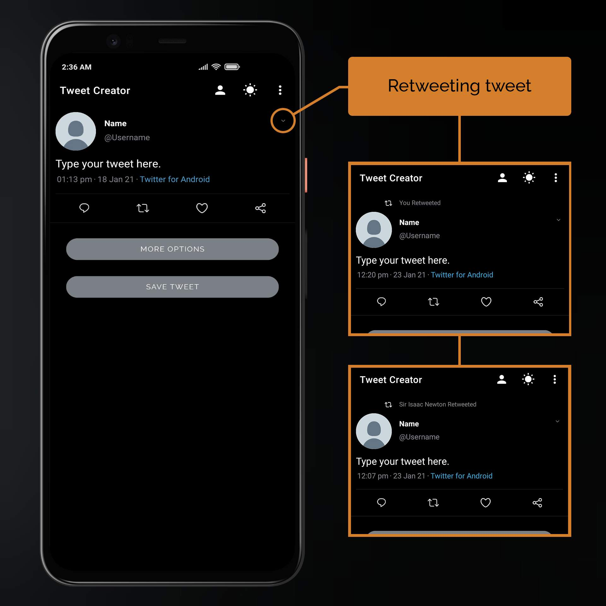

<!-- 1 -->
## How to switch theme ?

>Switching theme

For switching between dark and light mode of app, touch the **Sun** or **Moon** icon in toolbar.

<!-- 2 -->
## How to toggle tweet features ?
> Touch the **More Option** button

<!-- 3 -->
## How to set default user for future tweets?
> Setting default user for main tweet

1. Touch the **person icon** on the **toolbar**.
2. On the next **User list** screen, either select existing users or add one.
3. Touch any user profile in the list, for setting it a default user.
4. Enjoy, now you don't have to enter same user details again 🙂.

<!-- 4 -->
## How to add user to the user list ?
> Adding user to the user list

1. On the **home screen** of the app, Touch the **person icon**.
1. At bottom of the screen, Touch the **ADD USER** button.
1. Enter all the asked details, on the next screen
    * Name
    * Username
    * Select image
1. After entering all details, Touch the **ADD USER** button.

<!-- 5 -->
## How to edit users in user list ?
> Editing user in the user list

1. On the **home screen** of the app, Touch the **person icon**.
1. Long press on any user in the user list.
1. Edit any detail of the user and touch **EDIT USER**

<!-- 6 -->
## How to delete user from the user list ?
> Deleting user from the user list

1. On the **home screen** of the app, Touch the **person icon**.
1. **Left swipe** any user to delete it.

<!-- 7 -->
## How to retweet ?
> Retweeting 

1. Touch, down arrow on the right of the tweet.
1. Tap **You Retweeted** for changing retweet username.

<!-- 8 -->

## How to add replies ?
> Adding replies

Touch the **comment icon** for adding reply to the tweet.

<!-- 9 -->
## How to change number of likes and retweets in replies?
> Highlighting likes/retweet.

Tap on **like/retweet icons** for highlighting them.

> Changing like/retweet count.

Do **long press** on **like/retweet icons** to change counts.

<!-- 10 -->
## How to add verified badge to reply users ?
> Toggling verified badge of reply users.

Touch the share button of the reply, for adding verify badge.

<!-- 11 -->
## How to select saved users for replies?
> Selecting saved user profiles for replies

1. Touch the **3 vertical dots** on the right of the reply.
1. Now, on the **user list screen**, tap on any **user profile**, for selecting it for reply.

<!-- 12 -->
## How to create a reply thread ?
> Creating reply thread.

Touch **reply icon** of the reply for creating a **reply thread**.

<!-- 13 -->
## How to add comment count in reply thread ?

> Changing comment count on reply thread.

Long press on the **comment icon** of replies in reply thread.

>

