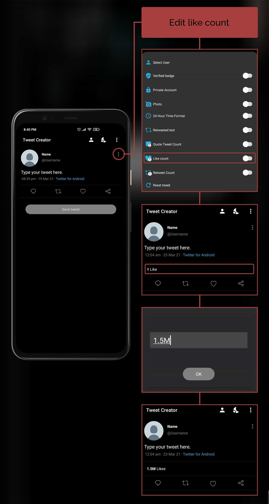
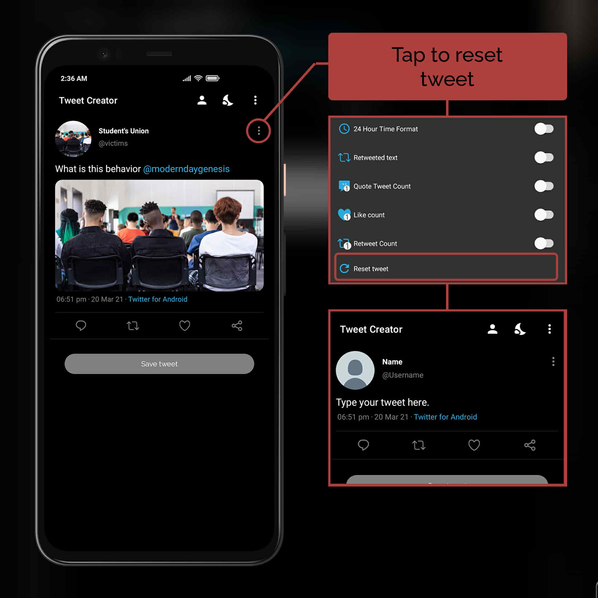

<!-- 1 -->
## How to switch theme ?

>Switching theme

For switching between dim, dark and light mode of app, touch the **Sun** or **Moon** icon on the toolbar, then choose any desired theme.

<!-- 2 -->
## How to toggle tweet options ?
> Toggling tweet options

Tap 3 dots on the **top right** of the tweet.

<!-- 3 -->
## How to set default user for future tweets?
> Setting default user for main tweet

1. Open **more options menu** by clicking on 3 dots. 
2. Tap **Select user** in the menu.
3. Choose any user from the list by tapping on the user profile.
4. Enjoy, now you don't have to enter same user details again 🙂.

<!-- 4 -->
## How to add users to the user list?
> Adding user to the user list

1. On the **home screen**, Touch the **human icon 🤵**.
1. At bottom of the screen, Touch the **ADD USER** button.
1. Enter all the asked details, on the next screen
    * Name
    * Username
    * Select image
1. After entering all details, Tap the **Add User** button.

<!-- 5 -->
## How to edit users in the user list?
> Editing user in the user list

1. On the **home screen**, Touch the **human icon 🤵**.
1. Tap on any user in the user list. 
1. Edit any detail of the user and tap **Edit User**

<!-- 6 -->
## How to delete users from the user list?
> Deleting user from the user list

1. On the **home screen**, Tap the **human icon 🤵**.
1. **Left swipe** any user to delete it from user list.

<!-- 7 -->
## How to retweet ?
> Retweeting 

1. Open **more options menu** by tapping on 3 dots.
2. Turn on **Retweeted text**.
3. Tap on **You retweted** for changing user.

## How to change retweet count?
> Changing retweet count

1. Open **more options menu** by tapping on 3 dots.
2. Turn on **Retweet count**.
3. Tap on retweet count.
4. Enter any desired count and save.

## How to change like count?
> Changing like count

1. Open **more options menu** by tapping on 3 dots.
2. Turn on **Like count**.
3. Tap on like count.
4. Enter any desired count and save.

## How to reset tweet?
> Resetting tweet

1. Open **more options menu** by tapping on 3 dots.
2. Tap on **Reset Tweet**.

## How to add quote tweet?

> Adding Quote tweet.

Tap share icon of the main tweet for accessing **quote tweet menu** and Enable Quote tweet.

## How to select saved user for quote tweet?

> Selecting saved user for quote tweet

1. Tap the share icon of the main tweet for accessing **quote tweet menu**.
2. Enable Quote Photo.
3. Tap **Select User**.
4. Choose any user from the list.

## How to add image in quote tweet?

> Adding images to Quote tweet.

1. Tap the share icon of the main tweet for accessing **quote tweet menu**.
2. Enable Quote Photo.
3. Choose any image from your device.

## How to reset quote tweet?

> Resetting quote tweet.

1. Tap the share icon of the main tweet for accessing **quote tweet menu**.
2. Tap on **Reset Quote Tweet**.

## How to add replies ?
> Adding replies

Touch the **comment icon** for adding reply to the tweet.

<!-- 9 -->
## How to highlight likes and retweets icons in replies?
> Highlighting likes/retweet icons.

Tap on **like/retweet icons** for highlighting them.

## How to toggle reply options?
> Toggling reply options

Tap 3 dots on the right of the reply, for accessing the reply options menu.

## How to select user for reply?
> Selecting user for reply

1. Open **reply options menu** by tapping on **3 dots** of the reply.
2. Tap on **Select User**.
3. Select any user from the list by tapping on it.

## How to change comment count of reply?
> Changing reply comment count

1. Open **reply options menu** by tapping on **3 dots** of the reply.
2. Tap on **Comment count**.
3. Enter any desired comment count and save.

> Tip: You can enter **0** or **leave count blank** for **disabling comment count**.

## How to change retweet count of reply?
> Changing reply retweet count

1. Open **reply options menu** by tapping on **3 dots** of the reply.
2. Tap on **Retweet count**.
3. Enter any desired retweet count and save.

> Tip: You can enter **0** or **leave count blank** for **disabling retweet count**.

## How to change like count of reply?
> Changing reply like count

1. Open **reply options menu** by tapping on **3 dots** of the reply.
2. Tap on **Like count**.
3. Enter any desired like count and save.

> Tip: You can enter **0** or **leave count blank** for **disabling like count**.

## How to delete a reply?
> Deleting a reply

1. Open **reply options menu** by tapping on **3 dots** of the reply.
2. Tap on **Delete** for deleting a reply

## How to create a reply thread?
> Creating reply thread.

Touch **reply icon** of the reply for creating a **reply thread**.

## How to toggle options for replies in reply thread?
> Toggling reply options in reply thread

Tap 3 dots on the right of the reply, for accessing the menu for replies in reply thread.

## How to delete a reply in reply thread?
> Deleting a reply in reply thread

1. Open **reply options menu** by tapping on **3 dots** of the reply.
2. Tap on **Delete** for deleting a reply in reply thread

